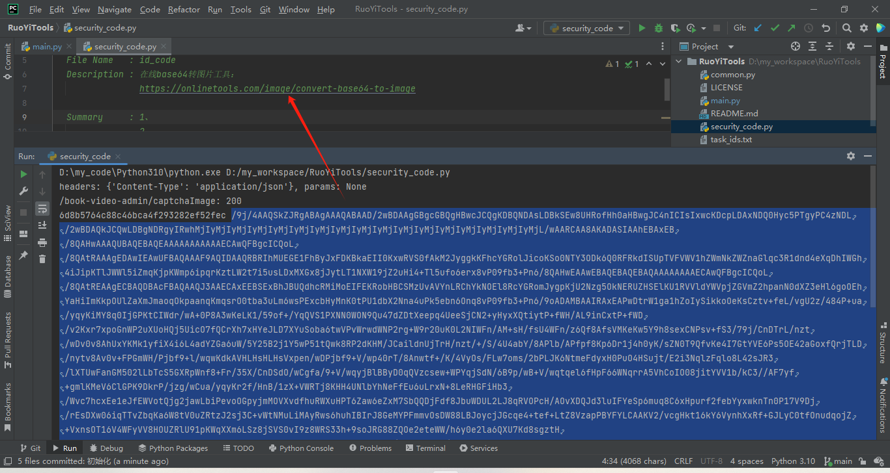
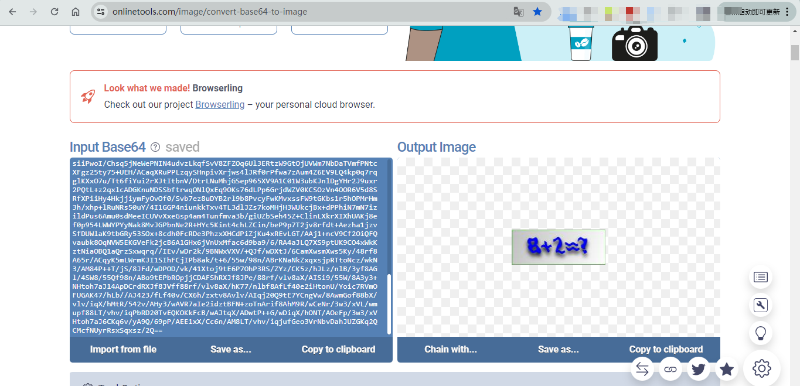
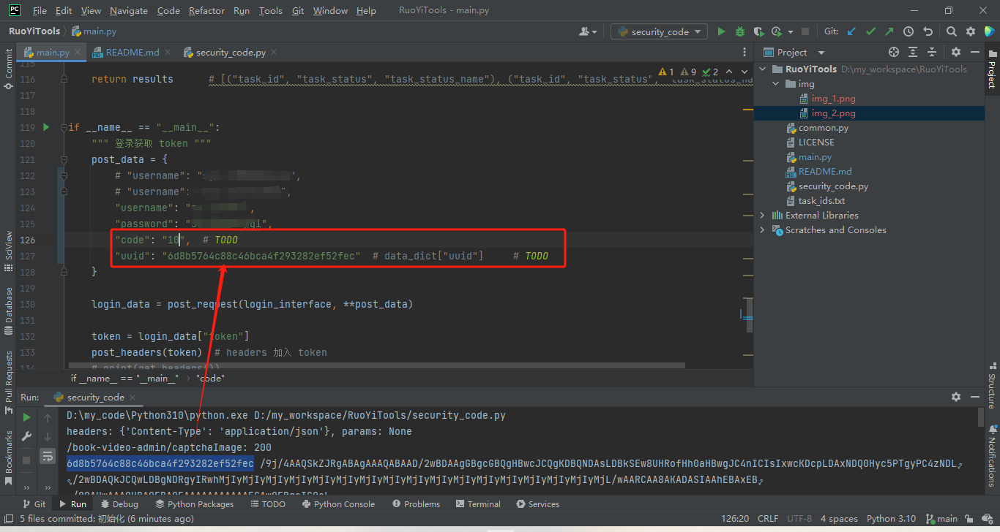

# RuoYiTools
开源项目：[若依 / RuoYi-Vue](https://gitee.com/y_project/RuoYi-Vue.git) 的相关自研工具

### [若依 / RuoYi-Vue 拓展功能](https://gitee.com/y_project/RuoYi-Vue)
* security_code.py
  - [x] (2024.4.1)支持获取验证码 base64（可通过在线转换成图片） + uuid
  - [ ] 待使用Python自动识别 base64 并解出验证码
* main.py
  - [x] (2024.4.1)支持 “uuid+验证码” 登录获取 token
  - [x] (2024.4.1)支持使用 token 进入系统获取其他数据（这里用“获取任务数据”作为例子）

### 其他工具
[在线base64转图片工具](https://onlinetools.com/image/convert-base64-to-image)
（在未完成base64验证码的自动计算之前，可以手动复制base64然后修改验证码）

### 简述偌依系统
1. 在登陆前，系统先请求一个简单的二维码，且每个二维码都有对应的 uuid
2. 只有当 “uuid + 正确的验证码答案 + 用户名 + 密码” 正确时，才能进行登录
3. 登录后得到 token，token 将放在每次 http 请求的 header 中
4. 请求系统具体业务的接口，进行程序工具的开发

